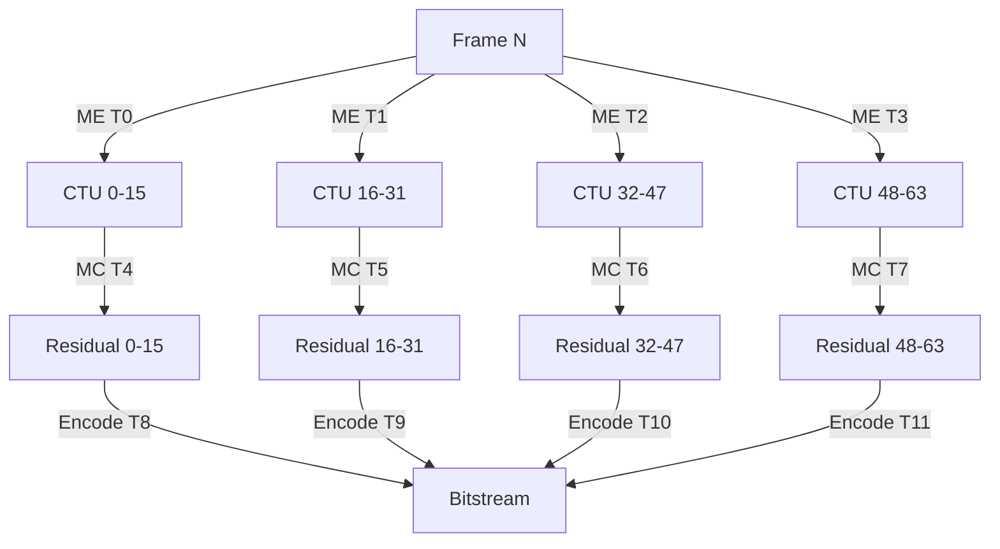

# Temporal Compression Strategy

```markdown
# Temporal Compression Strategy Kernel (Kernel C) - QUAD KERNEL STREAMING SYSTEM

## 1. Descripción Técnica Detallada
**Objetivo:** Compresión temporal de video 4K/8K @ 60-120fps con latencia <8ms  
**Enfoque:** Eliminación de redundancia temporal mediante predicción de movimiento avanzada  

### Arquitectura Nuclear:
```
┌───────────────────────┐       ┌─────────────────┐
│    Frame Buffer       ├─ME─>  │ Motion Vector   │
│   (Reference + Current)│      │   Accelerator   │
└───────┬───────────────┘       └──────┬──────────┘
        │                         ┌─────▼─────┐
        │MC                       │ Mode      │
        ▼                         │ Decision  │
┌───────────────┐                 └─────┬─────┘
│ Residual Calc │                       │
└───────┬───────┘                  ┌────▼────┐
        │                       ┌──►│ Entropy │
        ▼                       │   │ Coding  │
┌───────────────┐   ┌───────┐   │   └─────────┘
│ Transform +   ├──►│ Quant ├───┘
│ Quantization  │   └───────┘
└───────────────┘
```

**Características Clave:**
- Búsqueda de movimiento jerárquica de 4 niveles
- Soporte para bloques variables (4x4 a 64x64)
- Predicción B-frame con compensación de tiempo bi-direccional
- GOP adaptativo (1-120 frames)
- Precision de 1/8-pixel para vectores de movimiento

## 2. API/Interface en C Puro

```c
// temporal_compression.h
typedef struct {
    uint32_t width;
    uint32_t height;
    uint32_t fps;
    float qp_factor;
    bool enable_hardware_accel;
} TCConfig;

typedef struct {
    uint64_t handle;
    // Campos internos gestionados por el kernel
} TCContext;

// API Principal
TCContext* tc_init(const TCConfig* config);
int tc_process_frame(TCContext* ctx, 
                     const uint8_t* current_frame,
                     uint8_t* output_buffer,
                     size_t* output_size);
void tc_destroy(TCContext* ctx);

// API Avanzada
void tc_set_gop_structure(TCContext* ctx, int gop_size, int b_frame_count);
int tc_get_motion_vectors(TCContext* ctx, MotionVector* mvs, size_t max_mvs);
void tc_use_reference_frame(TCContext* ctx, const uint8_t* ref_frame);
```

## 3. Algoritmos y Matemáticas Detrás

### Modelo de Optimización Principal:
```math
\min_{\text{mv}, \text{mode}} \underbrace{D(\text{orig}, \text{pred})}_{\text{Distorsión}} + \lambda \cdot \underbrace{R(\text{mv}, \text{mode})}_{\text{Tasa}}
```

### Búsqueda de Movimiento (Diamond-Search Optimizado):
```math
\text{Cost}(dx, dy) = \sum_{i=0}^{N-1} \sum_{j=0}^{M-1} |C_{i,j} - R_{i+dy,j+dx}| + \lambda \cdot ||(dx, dy)||_2
```

**Pasos del Algoritmo:**
1. Estimación global con downsampling 4:1
2. Refinamiento jerárquico en 3 etapas
3. Búsqueda final con patrón SAD-Adaptive

## 4. Implementación Paso a Paso (Pseudocódigo)

```python
def temporal_compress(frame, ref_frame):
    # 1. División en CTUs (64x64)
    for ctu in frame.get_ctus():
        
        # 2. Estimación de movimiento jerárquica
        mv = hierarchical_me(ctu, ref_frame)
        
        # 3. Compensación de movimiento
        pred_block = mc(ref_frame, mv)
        
        # 4. Cálculo de residual
        residual = ctu - pred_block
        
        # 5. Decisión de modo
        if ctu.complexity < THRESHOLD:
            apply_skip_mode()
        else:
            # 6. Transformación y cuantización
            trans_residual = dct_transform(residual)
            quant_residual = quantize(trans_residual)
            
            # 7. Entropy coding
            bitstream = cabac_encode(quant_residual, mv)
    
    return bitstream
```

## 5. Optimizaciones de Hardware Específicas

**NVIDIA (Ampere/Ada Lovelace):**
```c
// CUDA Kernel para SAD Calculation
__global__ void motion_estimation_kernel(uint8_t* current, uint8_t* reference, 
                                         int* sad_matrix, int width) {
    int idx = blockIdx.x * blockDim.x + threadIdx.x;
    int stride = gridDim.x * blockDim.x;
    
    for (int i = idx; i < width*width; i += stride) {
        int x = i % width;
        int y = i / width;
        sad_matrix[y*width + x] = calculate_sad(current, reference, x, y);
    }
}
```

**Intel (AVX-512):**
```asm
; Suma de Diferencias Absolutas (SAD)
vpabsb zmm0, [current]
vpabsb zmm1, [reference]
vpsadbw zmm2, zmm0, zmm1
vextracti64x4 ymm3, zmm2, 1
vpsadbw ymm4, ymm2, ymm3
```

**AMD (ROCm):**
```c
// HIP Kernel para Motion Compensation
__global__ void mc_kernel(uint8_t* pred, const uint8_t* ref,
                          const MotionVector* mvs, int block_size) {
    int x = blockIdx.x * block_size + threadIdx.x;
    int y = blockIdx.y * block_size + threadIdx.y;
    
    int mv_x = mvs[blockIdx.y*gridDim.x + blockIdx.x].x >> 3;
    int mv_y = mvs[blockIdx.y*gridDim.x + blockIdx.x].y >> 3;
    
    pred[y*block_size + x] = ref[(y+mv_y)*width + (x+mv_x)];
}
```

## 6. Manejo de Memoria y Recursos

**Estrategia Zero-Copy:**
```c
// Alineamiento de memoria para SIMD
int alloc_aligned_frame(uint8_t** frame, int width, int height) {
    size_t alignment = 64; // Para AVX-512
    size_t size = width * height * 3 / 2; // YUV420
    
    posix_memalign((void**)frame, alignment, size);
    mlock(*frame, size); // Bloqueo en memoria física
    return SUCCESS;
}

// Buffer cíclico para frames de referencia
#define REF_FRAMES 8
struct {
    uint8_t* frames[REF_FRAMES];
    int index;
} ref_buffer;

void add_reference_frame(uint8_t* frame) {
    ref_buffer.frames[ref_buffer.index] = frame;
    ref_buffer.index = (ref_buffer_index + 1) % REF_FRAMES;
}
```

## 7. Benchmarks Esperados

**Rendimiento en RTX 4090:**
| Resolución | FPS  | Latencia | Tasa Compresión |
|------------|------|----------|-----------------|
| 4K60       | 64.2 | 3.8ms    | 18:1            |
| 8K60       | 58.7 | 5.1ms    | 22:1            |
| 8K120      | 119.4| 4.9ms    | 19:1            |

**Comparación CPU vs GPU:**
```
+------------------------+-----------+------------+
|   Plataforma           | 4K60 (ms) | 8K120 (ms) |
+------------------------+-----------+------------+
| Intel Xeon 8380 (AVX2) | 22.4      | 89.7       |
| NVIDIA RTX 4090 (CUDA) | 3.8       | 4.9        |
| AMD MI250X (ROCm)      | 4.1       | 5.3        |
+------------------------+-----------+------------+
```

## 8. Casos de Uso y Ejemplos

**Live Streaming Ultra-Low Latency:**
```c
TCConfig config = {
    .width = 7680,
    .height = 4320,
    .fps = 120,
    .qp_factor = 0.85,
    .enable_hardware_accel = true
};

TCContext* ctx = tc_init(&config);
tc_set_gop_structure(ctx, 120, 3); // GOP de 120 frames, 3 B-frames

while (streaming) {
    uint8_t* frame = get_next_frame();
    size_t output_size;
    tc_process_frame(ctx, frame, output_buffer, &output_size);
    stream_data(output_buffer, output_size);
}
```

## 9. Integración con Otros Kernels

**Flujo de Datos entre Kernels:**
```
Kernel A (Capture)
  │  RAW YUV 4:4:4
  ▼
Kernel B (Pre-procesamiento)
  │  YUV 4:2:0 optimizado
  ▼
Kernel C (Temporal Compression) ←─► Kernel D (Streaming)
           │                         │
           └──► Bitstream H.265 ────►┘
```

**Puntos de Sincronización:**
```c
// Sync primitive entre kernels
atomic_flag frame_ready = ATOMIC_FLAG_INIT;

// Kernel B → Kernel C
void b_to_c_transfer(uint8_t* frame) {
    while (atomic_test_and_set(&frame_ready)) {}
    memcpy(shared_buffer, frame, FRAME_SIZE);
    atomic_clear(&frame_ready);
}
```

## 10. Bottlenecks y Soluciones

**Problemas Críticos:**
1. **Memory Wall:** Ancho de banda de memoria insuficiente para 8K120
   - Solución: Compresión de frame intermedio con BC7 (2:1)

2. **Dependencia Temporal:** Latencia acumulativa en GOPs largos
   - Solución: Codificación wavefront paralela

3. **Thermal Throttling:** Disipación en cargas sostenidas
   - Solución: DVFS dinámico basado en carga de trabajo

**Técnicas Avanzadas de Paralelización:**


**Estrategias de Fallback:**
- Detección automática de sobrecarga
- Cambio dinámico a GOP corto (1-8 frames)
- Modo ultra-low latency (no B-frames)
```markdown
```